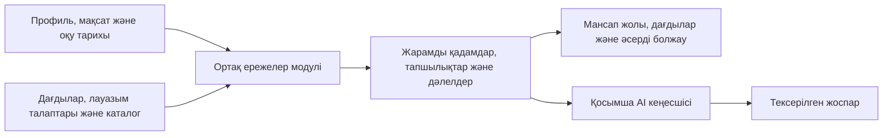

# Career Quest

**Мансаптық мақсаттан нақты әрі түсінікті оқу қадамына.**

[English](README.md) · **Қазақша** · [Русский](README.ru.md)

**Aruzhan** командасының Halyk Career Quest кейсіне арналған хакатон прототипі. Жоба берілген синтетикалық деректерді пайдаланады: қызметкер даму мүмкіндіктерін зерттейді, ал HR мамандары ортақ құзырет тапшылықтарын көреді.

## Қандай мәселені шешеді

Курстар каталогы қызметкерге келесі кезекте нені және не үшін оқу керегін өздігінен түсіндірмейді. Career Quest қызметкердің дағдыларын, оқу тарихын және таңдаған лауазымын оған қатысуға болатын оқу іс-шараларымен байланыстырады. Жүйе пайдалы келесі қадамдарды да, каталог әзірге жаба алмайтын дағды тапшылықтарын да түсіндіреді.

## Қазылар не көре алады

| Мүмкіндік | Прототипте қалай көрсетілген |
| --- | --- |
| Жеке мансап жолы | Әрдайым көрінетін мансап мақсаты, компьютерде қатар орналасқан карта мен қадам сипаттамасы, үшке дейін жарамды A/B/C қадамы және ұзақтық, қолжетімділік пен дағды белгілері. |
| Түсіндірілетін ұсыныстар | Нәтиже лауазымға, грейдке, алғышарттарға, қатысу тарихына, сессиялардың қолжетімділігіне және мақсатты дағдылардың өсуіне негізделеді. Бастапқы жазбалар, қатысу талаптары мен сүзу диагностикасы жиналмалы бөлімдерде қолжетімді. |
| Дағдылар мен мансап бағыттары | Дағдыларды таңдалған лауазым мен грейд талаптарымен салыстыру, жеке тапшылықтарды қарау, жоғарылау немесе сол грейдтегі басқа бағытқа ауысу мүмкіндігін дағдылар бойынша бағалау. |
| Әсерді алдын ала қарау | Дағды талаптарының болжамды орындалуын көру және Undo арқылы қайтару. Бағаланған дағдылар, оқу тарихы мен HR жиынтықтары өзгермейді. |
| HR талдауы | Қызметкерлердің сақталған мақсаттарына қатысты ең жиі кездесетін бес дағды тапшылығы және қызметкерлердің нақты саны. |
| Қосымша AI кеңесшісі | Шектеулі құралдар тізбегі деректерді жинап, жоспар ұсынады; қолданба коды іс-шара таңдауын тексеріп, нақты көрсеткіштерді шығарады. |
| Балама басқару | Пернетақта мен сенсорлық басқару, қолмен қосылатын 2D режимі, WebGL болмағандағы балама көрініс және қозғалысты азайту баптауы. |

## Жергілікті іске қосу

**Node.js 22.14.0 немесе одан жаңа нұсқасы**, npm және заманауи браузер қажет. Репозиторийдің түбірлік бумасында орындаңыз:

```powershell
npm ci
npm start -- 4174
```

[Career Quest қолданбасын жергілікті мекенжайда](http://127.0.0.1:4174) ашыңыз. Тоқтату: `Ctrl+C`. Порт аргументі де, `PORT` айнымалысы да берілмесе, әдепкі порт — `4173`. Бөлек құрастыру қадамы жоқ; lockfile ішінде Three.js `0.186.0` бекітілген. Кеңесші API-і үшін Node серверін пайдаланыңыз.

**Негізгі демоға API кілті қажет емес.** Орнатудан кейін ұсыныстар, дағдыларды зерттеу, әсерді алдын ала қарау және HR талдауы жергілікті жұмыс істейді. Қосымша AI кеңесшісіне сервердегі API кілті мен желіге қосылу қажет.

## Қазыларға арналған үш минуттық көрсетілім

Қолданбаның негізгі навигациясы ағылшын тілінде; төмендегі атаулар интерфейстегі жазуларға сәйкес келеді. README үш тілге аударылған, қолданба толық аударылмаған.

1. **`Employee profile` ішінен `E0101` профилін бастаңыз** — ол әдепкіде таңдалған. `My journey` бөлімінде Backend Engineer Junior → Middle мақсатын және `EV_005`, `EV_012`, `EV_040` іс-шараларына сәйкес A/B/C қадамдарын қараңыз.
2. **Бірінші ұсыныстың себебін көрсетіңіз.** A қадамын таңдап, `Why this step` түсіндірмесін оқып, `Expected change` бөліміндегі масштабталған `Current estimate` → `After learning` → `Target` дағды жолақтарын салыстырыңыз. Бастапқы деректерді көру үшін `Why it fits you & what comes next` → `View supporting records` ашып, содан кейін `Preview impact` басыңыз. Талаптардың болжамды орындалуы **42%-дан 48%-ға** өседі, ал бағалау деректеріне негізделген көрсеткіш **42%** болып қалады. `Undo` басып, балама басқаруды көрсету үшін `2D view` режимін қосыңыз.
3. **Дағды мен бағытты зерттеңіз.** `Skills` бөлімінде SQL таңдаңыз. Жеке дағдыға назар аудару жалпы ұсыныстарды алмастырмайды. `Change goal` арқылы басқа лауазым мен грейдті нақты таңдаңыз: уақытша таңдаулар мен алдын ала есептеу қалпына келтіріледі.
4. **HR үшін құндылығын көрсетіңіз.** `HR insights` бөлімінде бағаланған дағдылардың жиынтық тапшылығын қараңыз. Жергілікті мақсат өзгерісі мен әсерді алдын ала қарау сақталған мақсаттар бойынша есептелетін жиынтықтарға әсер етпейді.
5. **Шектеулі жағдайды көрсетіңіз.** `E0010` — каталогта жарамды тікелей қадам жоқ; `E0176` — алғышартты қалыптастыратын қадам (`EV_020` → `EV_021`, кейінгі қадам қайта бағалау мен сессия қолжетімділігіне тәуелді); `E0003` — алдымен мақсат таңдау қажет.

Провайдер бапталған болса, қосымша `AI career coach` бөлімін ашып, `Explain my next steps` таңдаңыз және `What the coach checked` жазбаларын қараңыз. Ұсынылған қадамды таңдағанда `Why this step` түсіндірмесі және `Practice challenge` нақты тапсырмасы көрсетіледі. `Build` бөлімінен бастап, дайындалатын нәтиже мен өлшемдерді көру үшін `Deliver & check` ашыңыз. Тапсырма мыналарды қамтиды: дамытылатын дағды, шағын міндет, дайындалатын жұмыс нәтижесі және тексеруге болатын екі-үш жетістік өлшемі. Ойдан шығарылған мысалдарды немесе жергілікті сынақ ортасын пайдаланыңыз. Бұл қосымша AI тапсырмалары іс-шаралар каталогынан тыс беріледі; олар оқуға тіркемейді, аяқтау жазбасын қоспайды және расталған дағды өсімін бермейді. Кілт болмаса, кеңесші қолжетімсіз екенін хабарлайды.

## Ұсыныстар қалай есептеледі



- **Алдымен қатысу талаптары:** міндетті іс-шаралар, ағымдағы лауазымға не грейдке сәйкес келмейтін нұсқалар, жүріп жатқан оқу, қайталауға болмайтын аяқталған іс-шаралар, орындалмаған алғышарттар, қолжетімді сессиясы жоқ және мақсатты дағды тапшылығын азайтпайтын нұсқалар алынып тасталады. Қалаған лауазым сол лауазымға ғана арналған курстарға қатысу құқығын бермейді.
- **Деректерге негізделген реттеу:** алдымен аса маңызды дағдылар тапшылығы, дамитын дағдылар саны және тапшылықтың жалпы азаюы ескеріледі. Ұқсас іс-шараны өткізіп алу, одан бас тарту немесе аяқтамай кету тарихы тең нұсқаларды реттеуге қолданылады; кейін тиімділік, ұзақтық, сессия күні және тұрақты іс-шара ID-і ескеріледі.
- **Бағалау мен болжам бөлек:** соңғы бағалаудан кейін, деректердің есептік күніне дейін аяқталған оқу каталогқа сай болжамды өсім береді. Ол бағаланған деңгейді өзгертпейді. Жергілікті әсер болжамы оқу тарихына да, AI кеңесшісінің деректеріне де енбейді.
- **Жетіспейтін ақпарат жасырылмайды:** мақсат жоқ болса, оны таңдау қажет; жарамды ұсыныс жоқ болса, тізім бос қалады. Бір қадамдық дайындық ұсыныстары тікелей ұсыныстардан бөлек беріледі. Үздік үштік — жеке нұсқалар, бірнеше курстан тұратын оңтайландырылған кесте емес.

## Деректер және бағалау

Берілген деректер жиынтығында **8 лауазым бойынша 200 қызметкер, 40 іс-шара, 60 дағды және 2 743 қатысу жазбасы** бар. Есептеулер компьютердің ағымдағы күніне емес, бекітілген **2026-10-01** деректер кесіндісіне сүйенеді.

**2026-09-23** күні `npm run evaluate` арқылы жергілікті қайта тексерілген нәтижелер:

| Көрсеткіш | Нәтиже |
| --- | ---: |
| Бағаланған қызметкер профильдері | 200 |
| Нақты мақсаты бар профильдер | 134 |
| Тікелей ұсыныс алған мақсатты профильдер | 108 / 134 (80,6%) |
| Әдепкі үздік үштік бойынша тексерілген тікелей ұсыныстар | 233 |
| Алғышартты қалыптастыруға арналған ұсыныстар | 6 профильге 6 ұсыныс |
| Барлық тікелей және дайындық кандидаттары тізімдеріндегі тексерілген жазбалар | 310 |
| Анықталған қатысу талаптарының бұзылуы | 0 |
| Мақсаты жоқ профильдер / мақсаты бар, бірақ тікелей ұсынысы жоқ профильдер | 66 / 26 |

Бұл сандар **қамтуды және шектеулердің сақталуын** өлшейді. Деректерде эталондық рейтинг, сарапшылардың өзектілік бағалары немесе өлшенген мансап нәтижелері жоқ. Сондықтан бұл көрсеткіштер ұсыныстардың дәлдігін немесе бизнес әсерін дәлелдемейді. [Ережелер аудиті мен мысалдар талдауын](docs/recommendation-evaluation.md) қараңыз.

## Қосымша AI кеңесшісін баптау

`backend/.env` файлы жоқ болса, [backend/.env.example](backend/.env.example) үлгісін сол жолға көшіріңіз. `OPENAI_API_KEY` мәнін жергілікті енгізіп, серверді қайта іске қосыңыз. Кілтті браузер кодына, коммитке немесе чатқа салмаңыз. Әдепкі модель — `gpt-6-luna`; кідіріс пен токен шығынын шектеу үшін пайымдау деңгейі `none` болып берілген. `OPENAI_MODEL` арқылы таңдалған басқа модель адаптердің Responses, function calling және structured output келісіміне сай болуы керек.

Кеңесші `retrieve_profile`, `inspect_gaps` және `find_eligible_activities` құралдарын пайдаланады. Ол іс-шара мен дағды ID-лерін, себеп кодтарын таңдап, дереккөздерге сілтемелері бар қысқа түсіндірмелер мен құрылымды тәжірибелік тапсырма (`skillId`, `task`, `deliverable`, `successCriteria`) береді. Тапсырма расталған дағдыға және қызметкер деңгейіне сәйкес болып, жалпы кеңестің орнына тексерілетін нақты нәтижені сипаттауы тиіс. Код қатысу талаптарын, сілтемелердің тиісті деректерге жатуын, мәтін пішімін және негізсіз уәделердің жекелеген түрлерін тексереді; бұл тексерулер AI мәтінінің мағыналық дұрыстығын дәлелдемейді. Нақты өсім, күндер мен прогресс ережелер бойынша есептеледі. Бастапқы жазбалар қалауыңыз бойынша ашылады; құралдарды пайдалану журналы қолжетімді.

Орындалу шектері: **30 секунд, модельдің 5 раунды, құралдарды 9 рет шақыру, әр раундта 2 000 шығыс токені және жиынтық 24 000 токен**. Құпия деректер серверде сақталады. Сервер `127.0.0.1` мекенжайында жұмыс істейді және тек рұқсат етілген frontend файлдарын, ортақ есептеу модулін және синтетикалық деректерді береді. Backend-тің өзге коды, тесттер, скрипттер және `.env` файлдары ашық маршруттарға кірмейді.

**Нақты провайдердің шектеулі тексерулері сәтті өтті:** **2026-09-23** күні `gpt-6-luna` `E0101` және `E0045` профильдерінің әрқайсысына үш тексерілген қадам берді. Әзірлеушіге қате жағдайлары бар API келісімі және скрипті, үлгі деректері мен тесттері бар шағын CSV валидаторы ұсынылды. Сату маманына іріктеу өлшемдері бар ойдан шығарылған ықтимал клиенттер тізімі, клиентпен сөйлесу сценарийі және пайдасы мен келесі әрекеті анық қысқа таныстырылым жазбасы берілді. Қолмен қарау нақты жұмыс нәтижелері мен бақыланатын өлшемдердің Junior деңгейіне сай шағын көлемде екенін көрсетті; бұл мысалдар мәтіннің мағыналық дәлдігін, оқу нәтижесін немесе барлық жоспарлардың сапасын дәлелдемейді. Промпт бөлшек банкке қатысты ойдан шығарылған жағдайларды қолдануды және басымдықты дағды тапшылығы, қатысу талаптары немесе қолжетімділік арқылы түсіндіруді сұрайды. Офлайн тесттер дайын жауаптар мен қате жағдайларын қосымша тексереді.

## Технологиялар және репозиторий құрылымы

Қарапайым HTML/CSS/JavaScript модульдері, Three.js, Node-тың HTTP сервері мен тест іске қосқышы. Браузер мен backend бір өзгеріссіз ұсыныс модулін пайдаланады. Manrope бекітілген `@fontsource-variable/manrope` `5.3.0` арқылы жергілікті беріледі; браузер сыртқы қаріп қызметіне сұрау жібермейді.

Ашық интерфейс ақ карточкаларды, қараға жақын `#17211D` мәтінін, қосымша `#526159` мәтінін және Halyk жасыл/сары акценттерін пайдаланады. Компьютердегі қаріп иерархиясы: бет тақырыбы 40px/800, карточка тақырыбы 24px/700, негізгі мәтін 17px/500, белгілер 14px/600. Дағды болжамдары мен оқудан кейінгі ықтимал өзгерістер бағаланған дағдылар көрсеткішінен бөлек беріледі.

```text
frontend/
  index.html            # Қолданбаның бастапқы беті
  src/                  # Мансап жолы, 3D карта, дағдылар, HR және стильдер
  tests/                # Frontend модульдік тесттері
backend/
  src/server.mjs        # HTTP API және рұқсат етілген ашық маршруттар
  src/coach.mjs         # AI процесі және провайдер адаптері
  src/domain/           # Ережелерге негізделген ортақ ұсыныс модулі
  data/career_quest/    # Берілген синтетикалық JSON/CSV жазбалары
  scripts/              # Барлық деректерді бағалау
  tests/                # Домен, кеңесші және HTTP интеграция тесттері
  .env.example          # Жергілікті провайдер баптауының үлгісі
docs/                   # Бағалау, дизайн дереккөздері және әзірлеу нұсқаулығы
```

Ашық деректер мекенжайы — `/data/career_quest/*`; ортақ модуль — `/shared/recommendations.mjs`. Halyk түстерінің дереккөздері [бренд деректерінде](docs/halyk-brand-sources.md) көрсетілген.

## Тексеру және ағымдағы шектеулер

| Команда | Мақсаты |
| --- | --- |
| `npm test` | Домен, frontend, кеңесшінің дайын жауаптары және HTTP тесттері |
| `npm run evaluate` | Барлық профильдерді, қатысу талаптарын және күтілетін өсімді тексеру |
| `npm run check` | Бапталған негізгі модульдердің синтаксисін тексеру |
| `git diff --check` | Өзгерістердегі бос орын қателерін тексеру |

**2026-09-23** күні жергілікті тексерілді: **63 тесттің 63-і өтті**; `npm run evaluate`, `npm run check` және `git diff --check` сәтті аяқталды. Бұл тексерулер жергілікті код пен провайдердің дайын жауаптарын қамтиды. Жоғарыдағы бөлек нақты API тексерулері екі профильді қамтиды; AI ұсыныстарының өзектілігі мен нәтижелері кең көлемде әлі бағаланған жоқ.

Бұл — синтетикалық деректерге арналған жергілікті прототип. Өндірістік аутентификация, HR рұқсаттарын басқару, нақты оқуға тіркеу, бос орындар ағыны және қызметтік өсу болжамы жоқ. Дағды талаптарының орындалуы жұмысқа қабылдану ықтималдығын білдірмейді; каталогтық өсім қайта бағалауды қажет етеді. Қызметкер мақсатының өзгерісі мен әсер болжамы тек жергілікті сессияда сақталады. Интерфейсті толық аудару, нақты деректерді қосу, өндірістік қолжетімділікті басқару және пайдаланушы нәтижелерін өлшеу — кейінгі жұмыс.

## README құжаттарын өзекті ұстау

Мүмкіндіктерге, пайдаланушы әрекеттеріне, архитектураға, іске қосуға, конфигурацияға, деректерге, бағалау нәтижелеріне немесе шектеулерге елеулі өзгеріс енгізілген сайын **README.md, README.kk.md және README.ru.md сол өзгеріспен бірге жаңартылуы тиіс**. Командалар, мысалдар, көрсеткіштер мен ескертулер үш тілде мағыналық жағынан сәйкес болуы керек; тұжырымдарды код пен тиісті тексерулерге сүйеніп растаңыз. Бұл талап [ассистент нұсқаулығында](AGENTS.md) және [әзірлеу тәртібінде](docs/agent/workflow.md) де бекітілген.
