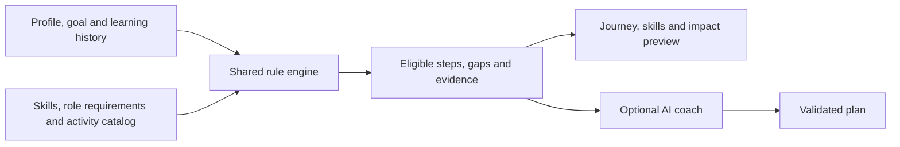

# Career Quest

**Turn a career goal into a clear, explainable next learning step.**

**English** · [Қазақша](README.kk.md) · [Русский](README.ru.md)

Hackathon prototype by team **Aruzhan**, built for the Halyk Career Quest case using the supplied synthetic data. Employees explore development options; HR sees shared competency gaps.

## Why it matters

A course catalog alone does not tell an employee what to learn next or why. Career Quest connects the employee's skills, learning history and chosen role to activities they can actually take. It explains both useful next steps and gaps the catalog cannot currently address.

## What judges can try

| Capability | What the prototype demonstrates |
| --- | --- |
| Personal career journey | A Three.js career floor with up to three eligible A/B/C checkpoints and a detail panel for each activity. |
| Explainable recommendations | Role, grade, prerequisites, participation history, session availability and target skill gains determine the result; source records and filter diagnostics are visible. |
| Skills and career exploration | Compare skills with a selected role and grade, inspect individual gaps, and explore upward or same-grade lateral skill matches. |
| Impact preview | Preview estimated skill coverage, then Undo. Assessed skills, completion history and HR totals stay unchanged. |
| HR insights | See the five most common assessed skill gaps against employees' saved goals, with explicit employee counts. |
| Optional AI coach | A bounded tool workflow retrieves evidence and proposes a plan; application code validates activity choices and renders exact facts. |
| Accessible alternatives | Native keyboard/touch controls, a manual 2D view, a WebGL fallback and reduced-motion support. |

## Run locally

Requires **Node.js 22.14.0 or later**, npm and a modern browser. From the repository root:

```powershell
npm ci
npm start -- 4174
```

Open [Career Quest on localhost](http://127.0.0.1:4174). Stop with `Ctrl+C`. The default port is `4173` when neither a port argument nor `PORT` is supplied. There is no build step; Three.js `0.186.0` is pinned in the lockfile. Use the Node server to run the coach API.

**No API key is needed for the main demo.** Recommendations, skill exploration, impact previews and HR insights work locally after installation. The optional AI coach needs server credentials and network access.

## Three-minute judge walkthrough

The app's main navigation is in English; the labels below match the UI. These three README versions translate the documentation, not the application.

1. **Start with `E0101`** in `Employee profile` (the default). In `My journey`, inspect the Backend Engineer Junior → Middle goal and the A/B/C choices: `EV_005`, `EV_012`, `EV_040`.
2. **Explain the first recommendation.** Select A and read `Why this helps`. Open `Why it fits you & what comes next` → `View supporting records` for the underlying evidence, then select `Preview impact`. Estimated coverage moves from **42% to 48%** while assessed coverage stays **42%**. Press `Undo`; try `2D view` to demonstrate the alternative controls.
3. **Explore a skill and a destination.** Open `Skills` and select SQL. This separate skill focus does not replace the overall recommendations. Use `Change goal` to explicitly choose another role and grade; transient selections and previews reset.
4. **Show HR value.** Open `HR insights` to inspect aggregate assessed gaps. A local goal change or impact preview does not alter these saved-goal totals.
5. **Show an honest edge case.** Select `E0010` for a genuine catalog gap, `E0176` for a prerequisite step (`EV_020` toward `EV_021`, conditional on reassessment and session availability), or `E0003` for an employee who must choose a goal first.

Optional, after configuring the provider: expand `AI career coach`, select `Explain my next steps`, and inspect `What the coach checked`. Select a returned step to read its AI explanation under `Why this helps` and its practice suggestion under `Try it at work`. Practice suggestions are outside the activity catalog; they do not create bookings or assessed gains. Without a key, the coach reports that it is unavailable.

## How recommendations work



- **Eligibility first:** exclude mandatory activities, wrong current roles or grades, active enrollments, completed non-repeatable activities, unmet prerequisites, unavailable sessions and activities that do not improve a remaining target gap. A desired role does not grant access to its restricted courses.
- **Evidence-based ordering:** prioritize critical target gaps, number of skills advanced and total gap reduction. Related missed/declined/dropped participation is a tie-breaker, followed by efficiency, duration, session date and stable event ID.
- **Separate assessment from estimates:** completed learning after the last review contributes catalog-based estimated gains up to the dataset date. It does not overwrite assessed proficiency. Local impact previews never enter completion history or coach evidence.
- **Keep missing information visible:** an absent goal requires a choice; an empty catalog result stays empty. Eligible one-step prerequisite suggestions are separate from direct recommendations. The top three are individual options, not an optimized multi-course schedule.

## Data and evaluation

The supplied dataset contains **200 employees across 8 roles, 40 activities, 60 skills and 2,743 participation records**. Calculations use the fixed snapshot **2026-10-01**, not the computer clock.

Reproduced locally with `npm run evaluate` on **2026-09-23**:

| Measure | Result |
| --- | ---: |
| Employee profiles evaluated | 200 |
| Profiles with an explicit goal | 134 |
| Goal-set profiles receiving direct suggestions | 108 / 134 (80.6%) |
| Direct recommendations checked, default top three | 233 |
| Prerequisite suggestions | 6 across 6 profiles |
| Entries checked across all direct/prerequisite candidate lists | 310 |
| Detected eligibility violations | 0 |
| Profiles without a goal / goal-set profiles without a direct suggestion | 66 / 26 |

These measure **coverage and constraint validity**. The data has no ground-truth ranking, expert relevance labels or measured career outcomes, so these figures do not establish recommendation accuracy or business impact. See the [rule audit and representative review](docs/recommendation-evaluation.md).

## Optional AI coach setup

If `backend/.env` does not already exist, copy [backend/.env.example](backend/.env.example) to that path. Set `OPENAI_API_KEY` locally and restart the server. Keep credentials out of browser code, commits and chat. The default configured model is `gpt-6-luna`, with reasoning effort `none` to limit latency and token use. An `OPENAI_MODEL` override must support the adapter's Responses, function-calling and structured-output contract.

The coach uses `retrieve_profile`, `inspect_gaps` and `find_eligible_activities`. It selects activity/skill IDs and reason codes, and supplies brief plain-text explanations and practice suggestions with source references. Code checks eligibility, reference membership, narrative format and narrowly defined unsupported promises; those checks do not prove the semantic accuracy of AI-written prose. Exact gains, dates and progress come from deterministic calculations. Supporting records are hidden behind optional disclosures, and the tool trace remains available.

Runtime limits: **30 seconds, 5 model rounds, 9 tool calls, 1,200 output tokens per round and 24,000 cumulative tokens**. Credentials stay server-side. The server binds to `127.0.0.1` and serves only explicitly allowed frontend assets, the shared pure engine and synthetic dataset files. Other backend source, tests, scripts and `.env` files are excluded from public routes.

**One bounded live provider check passed** on **2026-09-23** for `E0101` with `gpt-6-luna`: three checked steps, three tool calls, **8,771 ms**, **4,907 input tokens** and **458 output tokens**. This confirms the integration for one profile; it does not establish recommendation accuracy or general plan quality. Offline tests additionally cover fixture responses and failure cases.

## Stack and repository map

Vanilla HTML/CSS/JavaScript modules, Three.js, and a native Node HTTP server and test runner. The browser and backend share one recommendation engine.

```text
frontend/
  index.html            # Application entry point
  src/                  # Journey, 3D floor, skills, HR and styles
  tests/                # Frontend unit tests
backend/
  src/server.mjs        # HTTP API and explicit public routes
  src/coach.mjs         # AI workflow and provider adapter
  src/domain/           # Shared deterministic recommendation engine
  data/career_quest/    # Supplied synthetic JSON/CSV records
  scripts/              # Whole-dataset evaluation
  tests/                # Domain, coach and HTTP integration tests
  .env.example          # Local provider configuration template
docs/                   # Evaluation, design evidence and development guidance
```

Public URLs stay `/data/career_quest/*`; the shared engine is served at `/shared/recommendations.mjs`. Halyk color references are documented in [brand source evidence](docs/halyk-brand-sources.md).

## Verification and current limits

| Command | Purpose |
| --- | --- |
| `npm test` | Domain, frontend, coach fixture and HTTP tests |
| `npm run evaluate` | All employee profiles, eligibility and expected gains |
| `npm run check` | Syntax checks for the configured entry modules |
| `git diff --check` | Patch whitespace checks |

Verified locally on **2026-09-23**: **59/59 tests passed**; `npm run evaluate`, `npm run check` and `git diff --check` passed. These checks cover the local implementation and provider fixtures. The separate live check above covers one profile; broader AI relevance and outcome evaluation remain unmeasured.

This is a local synthetic-data prototype. It has no production authentication or HR authorization, real enrollment, vacancy feed or promotion prediction. Skill coverage is not a hiring probability; catalog gains need reassessment. Employee goal changes and impact previews are local session state. Full UI localization, real-data integration, production access controls and measured user outcomes remain future work.

## Keeping this README current

Every significant change to features, user flows, architecture, setup, configuration, data, evaluation results or limitations must update **README.md, README.kk.md and README.ru.md in the same change**. Keep commands, examples, metrics and caveats equivalent across languages; verify claims against the implementation and relevant checks. This is also part of the repository's [assistant guidance](AGENTS.md) and [development workflow](docs/agent/workflow.md).
