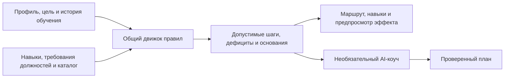

# Career Quest

**От карьерной цели — к понятному и обоснованному следующему шагу в обучении.**

[English](README.md) · [Қазақша](README.kk.md) · **Русский**

Хакатон-прототип команды **Aruzhan** для кейса Halyk Career Quest на предоставленных синтетических данных. Сотрудники изучают возможности развития, а HR видит общие дефициты компетенций.

## Какую проблему решаем

Сам по себе каталог курсов не объясняет сотруднику, чему учиться дальше и зачем. Career Quest связывает навыки, историю обучения и выбранную должность с мероприятиями, в которых сотрудник может участвовать. Система объясняет полезные следующие шаги и показывает дефициты, которые текущий каталог пока не закрывает.

## Что могут попробовать судьи

| Возможность | Что показывает прототип |
| --- | --- |
| Личный карьерный маршрут | Карьерная карта на Three.js, до трёх доступных шагов A/B/C и подробная карточка каждого мероприятия. |
| Объяснимые рекомендации | Результат учитывает должность, грейд, предварительные требования, историю участия, доступность сессий и прирост целевых навыков. Видны исходные записи и диагностика фильтров. |
| Навыки и карьерные направления | Сравнение навыков с выбранной должностью и грейдом, изучение отдельных дефицитов, подбор следующего грейда или другого направления на том же грейде по соответствию навыков. |
| Предпросмотр эффекта | Оценка ожидаемого покрытия требований с отменой через Undo. Подтверждённые оценки, история прохождения и сводка HR не меняются. |
| Аналитика HR | Пять наиболее распространённых дефицитов оценённых навыков относительно сохранённых целей с явным указанием числа сотрудников. |
| Необязательный AI-коуч | Ограниченный цикл инструментов собирает данные и предлагает план; код приложения проверяет выбор мероприятий и выводит точные факты. |
| Альтернативное управление | Кнопки для клавиатуры и сенсорного ввода, ручной переход в 2D, резервный режим без WebGL и поддержка уменьшения анимации. |

## Локальный запуск

Нужны **Node.js 22.14.0 или новее**, npm и современный браузер. Из корня репозитория:

```powershell
npm ci
npm start -- 4174
```

Откройте [Career Quest на localhost](http://127.0.0.1:4174). Остановка — `Ctrl+C`. Если не заданы ни аргумент порта, ни `PORT`, используется порт `4173`. Отдельной сборки нет; Three.js `0.186.0` закреплён в lockfile. Для API коуча нужен Node-сервер.

**Для основного демо API-ключ не нужен.** После установки рекомендации, просмотр навыков, предпросмотр эффекта и аналитика HR работают локально. Необязательному AI-коучу нужны серверный ключ и доступ к сети.

## Трёхминутный сценарий для судей

Основная навигация приложения на английском; названия ниже совпадают с интерфейсом. Три версии README переводят документацию, а не само приложение.

1. **Начните с `E0101`** в `Employee profile` — этот профиль выбран по умолчанию. В `My journey` посмотрите цель Backend Engineer Junior → Middle и шаги A/B/C: `EV_005`, `EV_012`, `EV_040`.
2. **Объясните первую рекомендацию.** Выберите A и прочитайте `Why this helps`. Откройте `Why it fits you & what comes next` → `View supporting records`, чтобы увидеть исходные данные, затем нажмите `Preview impact`. Расчётное покрытие требований меняется с **42% на 48%**, а покрытие по оценённым навыкам остаётся **42%**. Нажмите `Undo` и попробуйте `2D view`, чтобы показать альтернативное управление.
3. **Изучите навык и направление.** В `Skills` выберите SQL. Этот отдельный фокус не подменяет общие рекомендации. Через `Change goal` явно выберите другую должность и грейд: временные выделения и предпросмотр сбросятся.
4. **Покажите пользу для HR.** В `HR insights` изучите сводные дефициты оценённых навыков. Локальная смена цели и предпросмотр эффекта не меняют агрегаты по сохранённым целям.
5. **Покажите пограничный случай.** `E0010` — реальный пробел в каталоге; `E0176` — подготовительный шаг (`EV_020` к `EV_021`, с обязательной повторной оценкой и проверкой доступности сессии); `E0003` — сотрудник, которому сначала нужно выбрать цель.

Дополнительно, если провайдер настроен: раскройте `AI career coach`, нажмите `Explain my next steps` и изучите `What the coach checked`. Выберите предложенный шаг: в `Why this helps` появится объяснение, а рядом — конкретное практическое задание: развиваемый навык, небольшая задача, итоговый артефакт и два-три проверяемых критерия успеха. Используйте вымышленные примеры или локальную песочницу. Эти необязательные AI-задания находятся вне каталога мероприятий: они не записывают на обучение, не отмечают прохождение и не начисляют подтверждённый рост навыков. Без ключа коуч сообщает о недоступности.

## Как работают рекомендации



- **Сначала допуск:** исключаются обязательные мероприятия, несоответствие текущей должности или грейду, активное обучение, пройденные неповторяемые мероприятия, невыполненные предварительные требования, отсутствие доступных сессий и отсутствие прироста по оставшимся целевым дефицитам. Желаемая должность не даёт доступа к курсам с ограничением на эту должность.
- **Ранжирование по данным:** приоритет у критичных целевых дефицитов, числа развиваемых навыков и суммарного сокращения дефицита. История пропусков, отказов и незавершённого участия в похожих мероприятиях помогает упорядочить равные варианты; далее учитываются эффективность, длительность, дата сессии и стабильный ID мероприятия.
- **Оценки отдельно от прогнозов:** завершённое обучение после последней оценки и до даты среза даёт расчётный прирост по каталогу. Он не перезаписывает оценённую квалификацию. Локальный предпросмотр не попадает в историю прохождения или контекст коуча.
- **Недостающие данные видны:** если цели нет, её нужно выбрать; если подходящих мероприятий нет, список остаётся пустым. Допустимые одношаговые подготовительные рекомендации отделены от прямых. Три лучших варианта — отдельные возможности, а не оптимизированное расписание нескольких курсов.

## Данные и оценка

Предоставленный набор содержит **200 сотрудников по 8 должностям, 40 мероприятий, 60 навыков и 2 743 записи об участии**. Расчёты используют фиксированный срез **2026-10-01**, а не текущую дату компьютера.

Результаты воспроизведены локально командой `npm run evaluate` **2026-09-23**:

| Показатель | Результат |
| --- | ---: |
| Проверено профилей сотрудников | 200 |
| Профилей с явной целью | 134 |
| Профилей с целью, получивших прямые рекомендации | 108 / 134 (80,6%) |
| Проверено прямых рекомендаций в стандартной тройке | 233 |
| Подготовительных рекомендаций | 6 для 6 профилей |
| Проверено записей во всех списках прямых и подготовительных кандидатов | 310 |
| Обнаружено нарушений условий допуска | 0 |
| Профилей без цели / с целью, но без прямой рекомендации | 66 / 26 |

Это показатели **покрытия и соблюдения ограничений**. В данных нет эталонного ранжирования, экспертных оценок релевантности или измеренных карьерных результатов, поэтому эти числа не доказывают точность рекомендаций или бизнес-эффект. Подробнее — [аудит правил и разбор примеров](docs/recommendation-evaluation.md).

## Настройка необязательного AI-коуча

Если `backend/.env` ещё не существует, скопируйте [backend/.env.example](backend/.env.example) в этот файл. Локально задайте `OPENAI_API_KEY` и перезапустите сервер. Не помещайте ключ в браузерный код, коммиты или чат. Модель по умолчанию — `gpt-6-luna`, с уровнем рассуждения `none` для ограничения задержки и расхода токенов. Переопределение через `OPENAI_MODEL` должно поддерживать контракт адаптера для Responses, вызова функций и структурированного вывода.

Коуч использует `retrieve_profile`, `inspect_gaps` и `find_eligible_activities`. Он выбирает ID мероприятий и навыков, коды причин, а также формирует краткие объяснения и структурированное задание (`skillId`, `task`, `deliverable`, `successCriteria`) со ссылками на исходные записи. Задание должно соответствовать поддерживаемому навыку и уровню сотрудника, описывать конкретный проверяемый результат, а не общий совет. Код проверяет допуск, принадлежность ссылок к соответствующим данным, формат текста и отдельные виды необоснованных обещаний; эти проверки не доказывают смысловую точность AI-текста. Точные приросты, даты и прогресс рассчитываются детерминированно. Исходные записи раскрываются по желанию; журнал работы инструментов остаётся доступен.

Ограничения выполнения: **30 секунд, 5 раундов модели, 9 вызовов инструментов, 2 000 выходных токенов за раунд и 24 000 токенов суммарно**. Ключи остаются на сервере. Сервер слушает `127.0.0.1` и отдаёт только явно разрешённые файлы frontend, общий чистый модуль расчёта и синтетические данные. Остальной код backend, тесты, скрипты и `.env` исключены из публичных маршрутов.

**Ограниченные проверки реального провайдера прошли успешно** **2026-09-23** для `E0101` и `E0045` с `gpt-6-luna`: по три проверенных шага на профиль. Для разработки получены API-контракт с ошибочными запросами и небольшой CSV-валидатор со скриптом, примером данных и тестами. Для продаж — список вымышленных потенциальных клиентов с критериями отбора, сценарий разговора с клиентом и короткая запись презентации с понятной пользой и следующим действием. Ручная проверка показала конкретные артефакты и наблюдаемые критерии в посильном для Junior объёме; эти примеры не доказывают смысловую точность, результаты обучения или общее качество планов. Промпт просит использовать вымышленные ситуации розничного банка и объяснять приоритет через дефициты навыков, условия участия или доступность. Офлайн-тесты дополнительно проверяют подготовленные ответы и сценарии ошибок.

## Стек и структура репозитория

Обычные модули HTML/CSS/JavaScript, Three.js, встроенные HTTP-сервер и тестовый раннер Node. Браузер и backend используют один движок рекомендаций.

```text
frontend/
  index.html            # Точка входа приложения
  src/                  # Маршрут, 3D-карта, навыки, HR и стили
  tests/                # Модульные тесты frontend
backend/
  src/server.mjs        # HTTP API и явные публичные маршруты
  src/coach.mjs         # AI-процесс и адаптер провайдера
  src/domain/           # Общий детерминированный движок рекомендаций
  data/career_quest/    # Предоставленные синтетические записи JSON/CSV
  scripts/              # Оценка полного набора данных
  tests/                # Тесты домена, коуча и HTTP-интеграции
  .env.example          # Шаблон локальной конфигурации провайдера
docs/                   # Оценка, источники дизайна и инструкции по разработке
```

Публичные URL данных — `/data/career_quest/*`; общий движок доступен по `/shared/recommendations.mjs`. Источники цветов Halyk приведены в [документе о бренде](docs/halyk-brand-sources.md).

## Проверка и текущие ограничения

| Команда | Назначение |
| --- | --- |
| `npm test` | Тесты домена, frontend, подготовленных ответов коуча и HTTP |
| `npm run evaluate` | Все профили, условия допуска и ожидаемые приросты |
| `npm run check` | Проверка синтаксиса настроенных основных модулей |
| `git diff --check` | Проверка пробельных ошибок в патче |

Проверено локально **2026-09-23**: **63 из 63 тестов прошли**; `npm run evaluate`, `npm run check` и `git diff --check` выполнены успешно. Проверки охватывают локальную реализацию и подготовленные ответы провайдера. Отдельные проверки реального API выше охватывают два профиля; широкая оценка релевантности AI и результатов пока не проводилась.

Это локальный прототип на синтетических данных. В нём нет производственной аутентификации и разграничения HR-доступа, реальной записи на обучение, ленты вакансий или прогноза повышения. Покрытие требований по навыкам не означает вероятность найма; приросты из каталога требуют повторной оценки. Изменения цели сотрудника и предпросмотры хранятся только в локальной сессии. Полная локализация интерфейса, подключение реальных данных, производственный контроль доступа и измерение пользовательских результатов остаются дальнейшей работой.

## Как поддерживать README в актуальном состоянии

Каждое существенное изменение возможностей, пользовательских сценариев, архитектуры, запуска, конфигурации, данных, результатов оценки или ограничений должно обновлять **README.md, README.kk.md и README.ru.md в том же изменении**. Команды, примеры, показатели и оговорки должны быть эквивалентны во всех языках; сверяйте утверждения с реализацией и соответствующими проверками. Это также закреплено в [инструкциях для ассистентов](AGENTS.md) и [порядке разработки](docs/agent/workflow.md).
